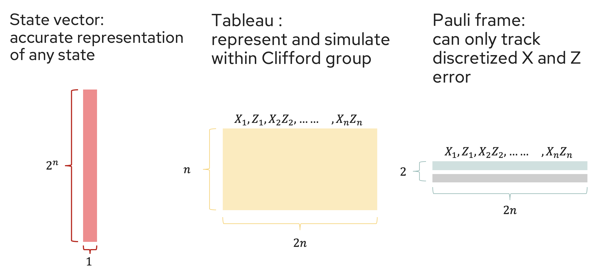
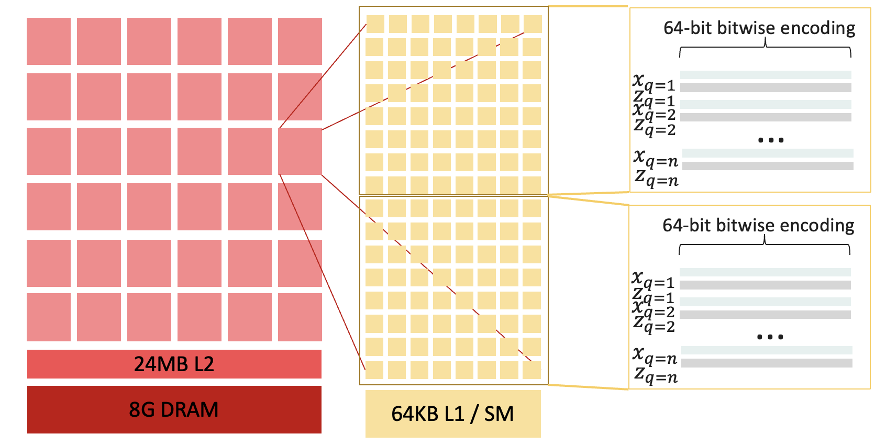
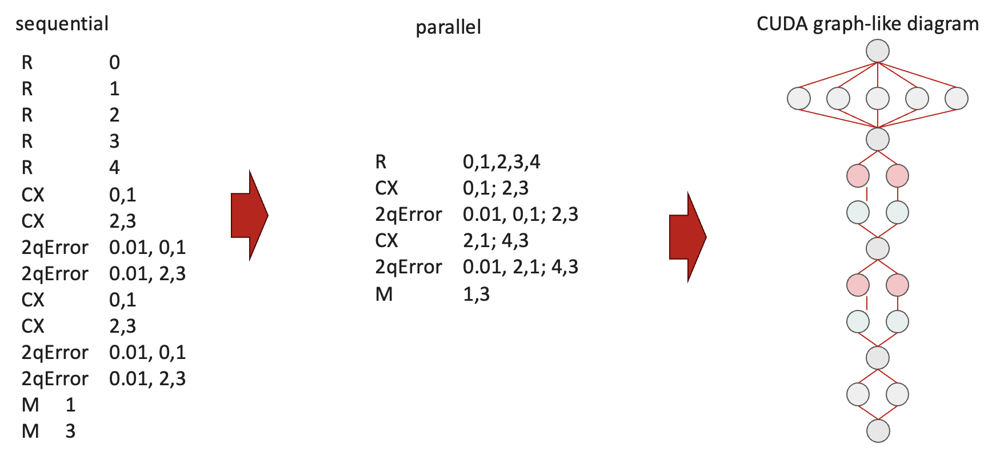
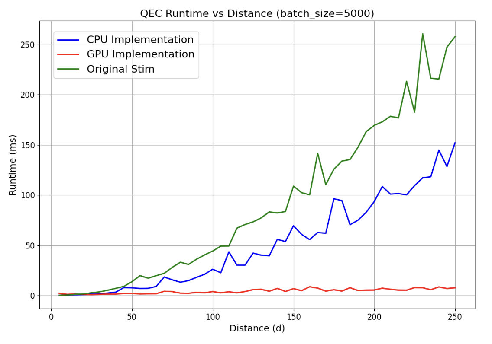
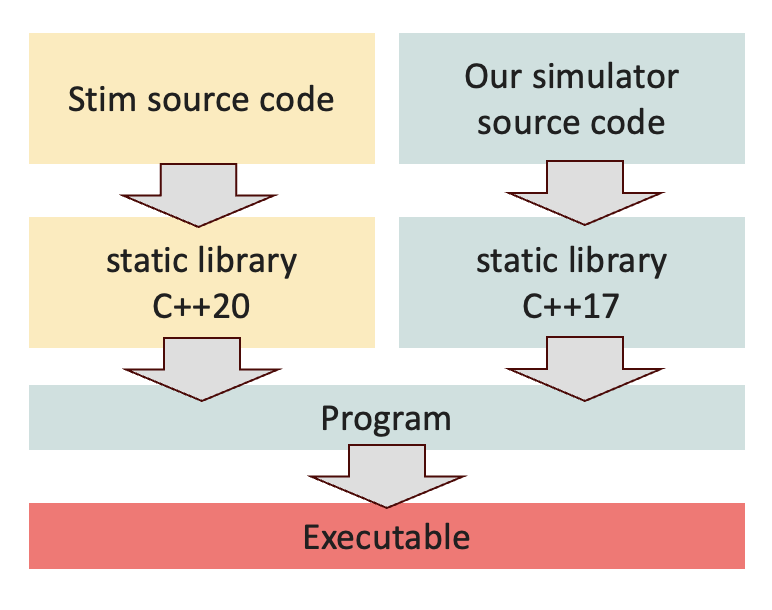
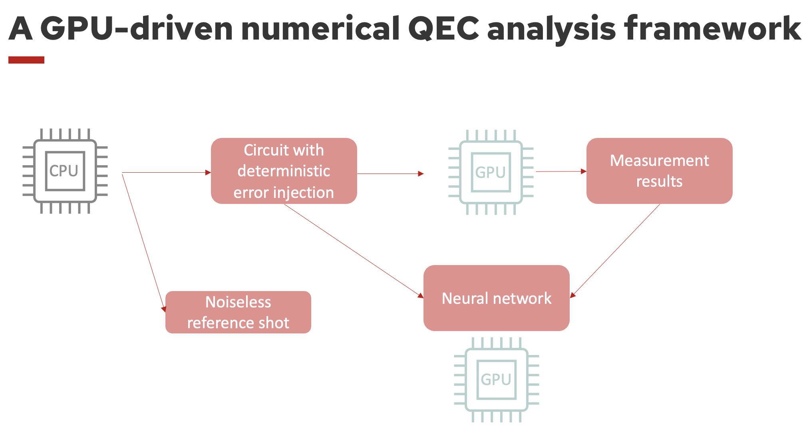

# GPU QEC Benchmark

This is a proof-of-concept implementation of Pauli frame simulation for quantum error correction (QEC) on GPU.

## Overview

The project implements frame-based simulation of quantum error correction codes. It compares the performance of the stim's original implementation, a minimal CPU implementation with the minimal GPU implementation. Currently, I only have repetition codes implemented.














The build system is configured to use:
- C++20 for host code (Stim and main executables)
- C++17 for device code (CUDA implementation)

## Usage

```bash
qec_benchmark --debug (optional) distance batch_size num_rounds
```

```bash
./qec_benchmark --debug 75 5000 75

Output:
Testing repetition code with:
  distance: 75
  batch_size: 5000
  num_rounds: 75
----------------------------------------
CPU time: 13.984ms
GPU time: 2.88286ms
GPU Speedup vs CPU: 4.85075x
GPU Speedup vs Original: 9.16509x


## Implementation Details

The implementation uses several parallelization strategies:

1. **Data Parallelism**: Each 64-bit word in GPU simulation stores bits from 64 different simulations (Stim has AVX256)
2. **Instruction Parallelism**: Each CUDA thread processes can be assigned to a different instruction as long as they are independent.

### Key Files

Core Simulation:
- `frame_simulator_base.h`: Abstract base class defining the common interface for both CPU and GPU simulators
- `frame_simulator_cpu.h/cpp`: CPU implementation of the frame simulator using bit-level parallelism
- `frame_simulator_gpu.h/cu`: GPU implementation of the frame simulator using CUDA
- `cuda_kernels.cuh/cu`: Core CUDA kernels for quantum operations (ZCX, H, M gates)
- `operation_batch.cuh/cu`: Batch processing system for efficient GPU operation queueing

Debug and Testing:
- `debug_flags.h/cpp/cu`: Debug output control system shared between host and device code
- `testing.cpp`: Unit tests and basic functionality verification
- `qec_benchmark.cpp`: Main benchmarking program comparing CPU vs GPU implementations

Build System:
- `CMakeLists.txt`: Main build configuration handling C++20 (host) and C++17 (device) code
- `.gitignore`: Version control ignore patterns for build artifacts

Each component is designed to be modular and follows a clear separation between the CPU and GPU implementations while sharing a common interface through the base simulator class.
